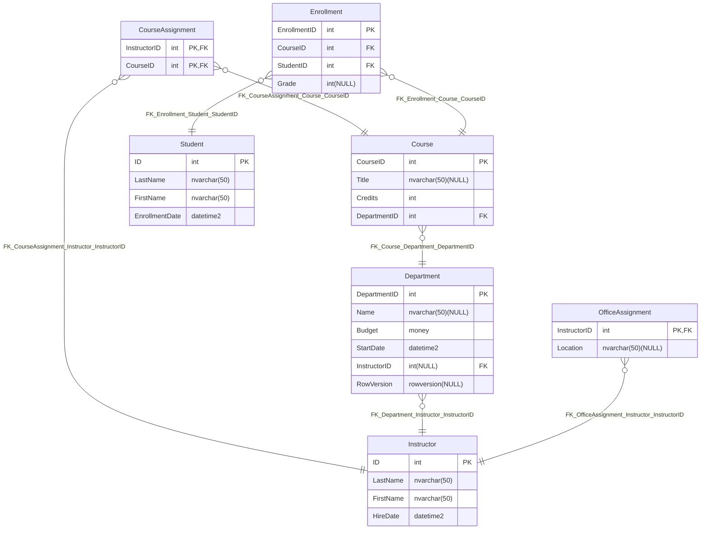

## ContosoUniversity.Databases

```mermaid
erDiagram
  Course {
    CourseID int PK
    Title nvarchar(50)(NULL) 
    Credits int 
    DepartmentID int FK
  }
  Course }o--|| Department : FK_Course_Department_DepartmentID
  CourseAssignment {
    InstructorID int PK,FK
    CourseID int PK,FK
  }
  CourseAssignment }o--|| Course : FK_CourseAssignment_Course_CourseID
  CourseAssignment }o--|| Instructor : FK_CourseAssignment_Instructor_InstructorID
  Department {
    DepartmentID int PK
    Name nvarchar(50)(NULL) 
    Budget money 
    StartDate datetime2 
    InstructorID int(NULL) FK
    RowVersion rowversion(NULL) 
  }
  Department }o--|| Instructor : FK_Department_Instructor_InstructorID
  Enrollment {
    EnrollmentID int PK
    CourseID int FK
    StudentID int FK
    Grade int(NULL) 
  }
  Enrollment }o--|| Course : FK_Enrollment_Course_CourseID
  Enrollment }o--|| Student : FK_Enrollment_Student_StudentID
  Instructor {
    ID int PK
    LastName nvarchar(50) 
    FirstName nvarchar(50) 
    HireDate datetime2 
  }
  OfficeAssignment {
    InstructorID int PK,FK
    Location nvarchar(50)(NULL) 
  }
  OfficeAssignment }o--|| Instructor : FK_OfficeAssignment_Instructor_InstructorID
  Student {
    ID int PK
    LastName nvarchar(50) 
    FirstName nvarchar(50) 
    EnrollmentDate datetime2 
  }
```
